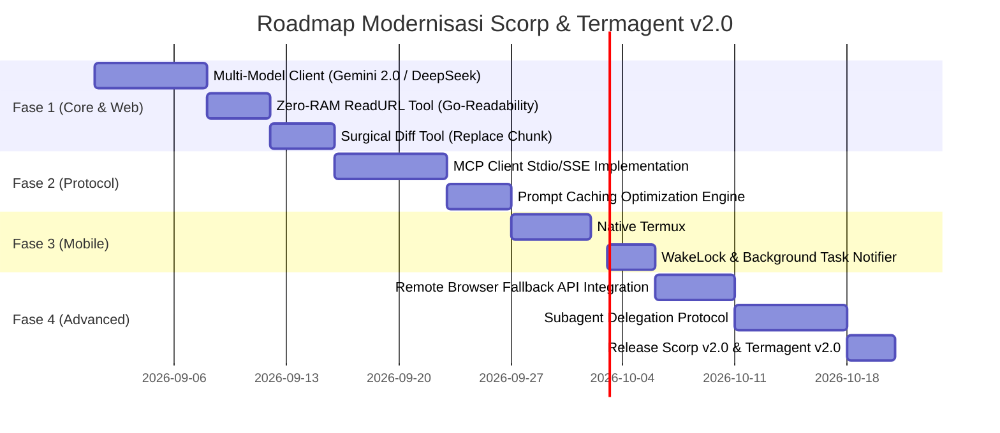

# AI Coding Agent Modernization Roadmap & Blueprint (v2.0)

> **State-of-the-Art (SOTA) Research & Comprehensive Engineering Upgrade Plan**  
> **Target Repositories:** [`wahyuzero/scorp`](https://github.com/wahyuzero/scorp) (Go) & [`wahyuzero/termagent`](https://github.com/wahyuzero/termagent) (TypeScript/Termux)  
> **Focus:** Memutakhirkan engine agent dari era awal (GPT-4/GLM) ke era modern (Multi-Model, Prompt Caching, MCP Standard, Surgical Diffs, Ultra-Low-RAM Web Engine, Native Termux).

---

## 📌 Daftar Isi
1. [Lanskap Model AI Modern & Verifikasi Data (2026)](#1-lanskap-model-ai-modern--verifikasi-data-2026)
2. [Evaluasi Arsitektur Scorp & Termagent Saat Ini](#2-evaluasi-arsitektur-scorp--termagent-saat-ini)
3. [Pilar Upgrade 1: Multi-Model & Fallback Engine](#3-pilar-upgrade-1-multi-model--fallback-engine)
4. [Pilar Upgrade 2: Prompt Caching & Token Economics](#4-pilar-upgrade-2-prompt-caching--token-economics)
5. [Pilar Upgrade 3: Surgical Diff Editing (Bukan Full Overwrite)](#5-pilar-upgrade-3-surgical-diff-editing-bukan-full-overwrite)
6. [Pilar Upgrade 4: Standardisasi MCP (Model Context Protocol)](#6-pilar-upgrade-4-standardisasi-mcp-model-context-protocol)
7. [Pilar Upgrade 5: Subagent & Task Delegation System](#7-pilar-upgrade-5-subagent--task-delegation-system)
8. [Pilar Upgrade 6: Deep Termux & Mobile Performance Optimization](#8-pilar-upgrade-6-deep-termux--mobile-performance-optimization)
9. [Pilar Upgrade 7: Ultra-Low-RAM Web Engine (< 5MB RAM di VPS 512MB & Termux)](#9-pilar-upgrade-7-ultra-low-ram-web-engine--5mb-ram-di-vps-512mb--termux)
10. [Roadmap Eksekusi Teknis (Fase 1 s.d. 4)](#10-roadmap-eksekusi-teknis-fase-1-sd-4)

---

## 1. Lanskap Model AI Modern & Verifikasi Data (2026)

### 📊 Tabel Perbandingan Model AI Coding Saat Ini:

| Model | Provider | Jendela Konteks | Harga Input / Output (per 1M token) | Cache Hit Discount | Karakteristik Utama |
|---|---|---|---|---|---|
| **Gemini 1.5 / 2.0 Flash** | Google | **1,000,000+ token** | **~$0.075 / $0.30** | Diskon hingga **~90%** ($0.0075) | Respon sub-detik (< 1s), telan seluruh repo, gratis kuota harian. |
| **DeepSeek V3** | DeepSeek / OpenRouter | **128,000 token** | **~$0.14 / $0.28** | Diskon **~50%-80%** ($0.014) | SOTA reasoning, sangat murah, akurat untuk refactoring besar. |
| **DeepSeek R1** | DeepSeek / OpenRouter | **128,000 token** | **~$0.55 / $2.19** | - | Model penalaran CoT (*Chain of Thought*) untuk debugging rumit. |
| **Qwen 2.5 Coder (32B/72B)** | Alibaba / OpenRouter | **128,000 token** | **~$0.20 / $0.60** | - | Khusus sintaks kode, bisa di-host lokal via Ollama. |
| **Claude 3.5 Sonnet** | Anthropic | **200,000 token** | **$3.00 / $15.00** | Diskon **90%** ($0.30) | Standar industri tertinggi untuk coding complex, tapi lebih mahal. |

---

## 2. Evaluasi Arsitektur Scorp & Termagent Saat Ini

### 🦂 Status `scorp` (Golang Engine):
* **Kelebihan:** Ditulis dengan Go (performa native, konsumsi memori rendah ~15MB, single binary, startup kilat, mudah di-compile untuk ARM64 Android).
* **Area Upgrade:** Loop model perlu dukungan dynamic streaming SSE untuk Gemini & DeepSeek; parser tool calls perlu standarisasi JSON Schema; peremajaan MCP client; penggantian headless browser lokal berat dengan Tiered Web Engine.

### 📱 Status `termagent` (TypeScript Engine):
* **Kelebihan:** Integrasi brilian dengan `Termux:API` (notifikasi Android, dialog konfirmasi modal, clipboard sync, haptic vibration).
* **Area Upgrade:** Migrasi runtime ke **Bun / Node 22+ Native ARM64** untuk memangkas *memory footprint* `node_modules`; implementasi chunk replacement editing.

---

## 3. Pilar Upgrade 1: Multi-Model & Fallback Engine

Menerapkan sistem routing model cerdas bertingkat (*Tiered Model Routing*):

```
                       [ User Input / Task ]
                                 ⬇️
            [ Complexity Router / Task Classifier ]
             /                   |                   \
   [ Simple Query / Read ]   [ Code Edit / Gen ]   [ Deep Bug / Architecture ]
             ⬇️                  ⬇️                     ⬇️
      Gemini Flash          DeepSeek V3 /          DeepSeek R1 /
      ($0.075/1M token)     Qwen 2.5 Coder         Claude Sonnet
```

### 🛡️ Automatic Fallback Chain:
Jika API utama mengalami rate limit (HTTP 429) atau downtime (HTTP 503), agent otomatis beralih ke provider cadangan tanpa memutus sesi:
`Gemini Flash ➔ DeepSeek V3 ➔ Qwen Coder ➔ OpenRouter / 9Router`.

---

## 4. Pilar Upgrade 2: Prompt Caching & Token Economics

Pada agent coding biasa, setiap langkah (*step*) mengirim ulang seluruh riwayat chat, instruksi sistem, dan file-file yang dibaca. Ini membuat biaya token membengkak secara eksponensial.

### ⚡ Strategi Caching:
1. **Static System Prefix:** Instruksi sistem, format tools, dan aturan coding diletakkan di bagian paling awal prompt (posisi tetap).
2. **Repository Map Prefix:** Ringkasan pohon file proyek diletakkan setelah system prompt.
3. **Hasil:** Setiap turn percakapan hanya membayar token baru (*cache read hit*), menghemat **75%–90% total biaya API**.

---

## 5. Pilar Upgrade 3: Surgical Diff Editing (Bukan Full Overwrite)

### 🛑 Masalah Cara Lama (Full File Rewrite):
* File `index.html` (500 baris) diedit 2 baris $\rightarrow$ AI menulis ulang 500 baris.
* Memakan 2.000+ output token, lambat (15-30 detik), dan rawan memotong kode yang tidak sengaja terhapus.

### ✂️ Solusi Modern (Chunk Replacement / Exact Match):
Tool `replace_file_content` hanya menerima 4 parameter:
```typescript
interface ReplaceFileContentArgs {
  target_file: string;
  start_line: number;
  end_line: number;
  target_content: string;      // Teks eksak yang ingin diganti (5-10 baris)
  replacement_content: string; // Teks pengganti baru
}
```
* **Hasil:** AI hanya mengeluarkan 50 token. Waktu eksekusi turun dari 20 detik menjadi **0.8 detik** di HP!

---

## 6. Pilar Upgrade 4: Standardisasi MCP (Model Context Protocol)

Mengadopsi protokol terbuka **Anthropic MCP (2025/2026 Standard)**:

```
[ Scorp / TermAgent Core ]
        │
        ├── Stdio / SSE Transport (JSON-RPC 2.0)
        │
        ├── 📂 MCP Filesystem Server
        ├── 🌐 MCP CloakBrowser / Headless Browser
        ├── 🗄️ MCP SQLite / Database
        ├── 🐙 MCP GitHub Server
        └── 📱 MCP Termux:API Bridge
```

Dengan MCP, `scorp` dan `termagent` tidak perlu menulis ulang integrasi tool baru. Cukup pasang konfigurasi server di `mcp.json`.

---

## 7. Pilar Upgrade 5: Subagent & Task Delegation System

Untuk proyek besar, chat history utama cepat penuh (*context bloat*). Solusinya adalah delegasi subagent:

1. **Main Planner Agent:** Mengatur strategi, membagi task, dan berinteraksi dengan user.
2. **Research Subagent (Read-Only):** Membaca puluhan file dan mencari grep di background, lalu hanya mengembalikan ringkasan 3 baris ke agent utama.
3. **Execution Subagent (Worker):** Menjalankan build/test di workspace terisolasi.

---

## 8. Pilar Upgrade 6: Deep Termux & Mobile Performance Optimization

1. **Kompilasi Binary Native Android (Go):**
   ```bash
   CGO_ENABLED=0 GOOS=android GOARCH=arm64 go build -ldflags="-s -w" -o scorp-termux main.go
   ```
   * Menghasilkan binary tunggal ~12MB tanpa dependensi libc eksternal, jalan langsung di `/data/data/com.termux/files/usr/bin/scorp`.
2. **Optimasi I/O untuk Penyimpanan eMMC / UFS HP:**
   * Menggunakan `fd` dan `ripgrep` native binary Termux yang diakses lewat child process streams.
3. **Background Notification & WakeLock:**
   * Memanfaatkan `termux-wake-lock` saat agent mengerjakan task multi-step agar Android tidak mematikan proses saat layar HP mati.
   * `termux-notification` untuk memberitahu user saat task selesai.

---

## 9. Pilar Upgrade 7: Ultra-Low-RAM Web Engine (< 5MB RAM di VPS 512MB & Termux)

### 🛑 Masalah Utama:
Menjalankan Headless Chrome/Chromium secara lokal di VPS 512MB–1GB atau Termux memakan **400MB–800MB RAM**, memicu *OOM (Out Of Memory) Killer* yang membuat proses agent mati seketika.

### 💡 3 Solusi Arsitektur Low-RAM Browser:

```
                      [ Permintaan Browsing AI ]
                                  ⬇️
               [ Apakah Halaman Butuh Render JS Kompleks? ]
                      /                       \
                 (TIDAK: 90%)              (YA: 10%)
                     ⬇️                        ⬇️
          [ Opsi 1: HTTP + Readability ]   [ Opsi 2: Remote Browser API ]
             (RAM: ~2 MB - 5 MB)              (RAM Lokal: 0 MB!)
                                               [ Opsi 3: Chromium Low-RAM ]
                                                  (RAM: ~80 MB - 120 MB)
```

---

### 🌐 Opsi 1 (Default): Zero-RAM HTTP Fetch + Readability Parser (~2MB RAM)
90% kebutuhan AI adalah membaca teks (dokumentasi, GitHub, StackOverflow, berita, artikel blog). Tidak perlu membuka browser penuh!

* **Implementasi di Go (`scorp`):**
  1. Unduh HTML dengan `net/http` standar Go (waktu eksekusi: ~50ms).
  2. Ekstrak konten artikel inti menggunakan library **`go-shiori/go-readability`** (porting dari mesin Firefox Reader).
  3. Konversi HTML bersih ke format Markdown ringkas menggunakan `JohannesKaufmann/html-to-markdown`.

```go
// internal/tools/read_url.go
package tools

import (
    "net/http"
    "time"
    readability "github.com/go-shiori/go-readability"
    md "github.com/JohannesKaufmann/html-to-markdown"
)

func ReadURL(url string) (string, error) {
    client := &http.Client{Timeout: 10 * time.Second}
    resp, err := client.Get(url)
    if err != nil {
        return "", err
    }
    defer resp.Body.Close()

    // 1. Ekstrak konten utama (buang script, css, iklan)
    article, err := readability.FromReader(resp.Body, resp.Request.URL)
    if err != nil {
        return "", err
    }

    // 2. Konversi ke Markdown
    converter := md.NewConverter("", true, nil)
    markdown, err := converter.ConvertString(article.Content)
    if err != nil {
        return article.TextContent, nil
    }

    return "# " + article.Title + "\n\n" + markdown, nil
}
```
* **Konsumsi RAM:** **Hanya ~2 MB – 5 MB!**
* **Kecepatan:** **10x lebih cepat** daripada membuka tab browser.

---

### ☁️ Opsi 2: Remote / Offloaded Browser API (RAM Lokal = 0 MB!)
Untuk website SPA berat (Single Page App React/Vue), halaman interaktif, atau web yang diproteksi antibot:

* **Prinsip:** Jangan jalankan Chromium di VPS/HP kentang kamu. Biarkan server cloud luar yang me-render, dan agent kamu cuma menerima hasil Markdown bersih via REST API sederhana.
* **Integrasi Service:**
  * **Cloudflare Browser Rendering API** (Tersedia free tier).
  * **Firecrawl / Tavily API:** Kirim URL $\rightarrow$ Terima Markdown bersih.
  * **Self-Hosted Browserless.io di VPS Gratisan Terpisah:** Panggil via WebSocket CDP tanpa membebani VPS utama.
* **Konsumsi RAM Lokal:** **0 MB overhead!**

---

### ⚙️ Opsi 3: Chromium Lokal Teroptimasi Ekstrem (~80MB–120MB RAM)
Jika terpaksa menjalankan Chromium lokal di VPS 1GB:

Gunakan flag alokasi memori ketat berikut saat meluncurkan Chromium:
```bash
chromium-browser \
  --headless=new \
  --disable-gpu \
  --single-process \
  --no-zygote \
  --renderer-process-limit=1 \
  --disable-extensions \
  --disable-background-networking \
  --disable-software-rasterizer \
  --disable-dev-shm-usage \
  --js-flags="--max-old-space-size=64"
```
* **Hasil:** Membatasi V8 heap memori ke 64MB dan mematikan multiprocess. RAM turun dari ~500MB+ menjadi **~80MB–120MB**.

---

## 10. Roadmap Eksekusi Teknis



---

*Cetak biru ini disusun berdasarkan riset model AI dan arsitektur agent termutakhir. Siap diimplementasikan bertahap.*
