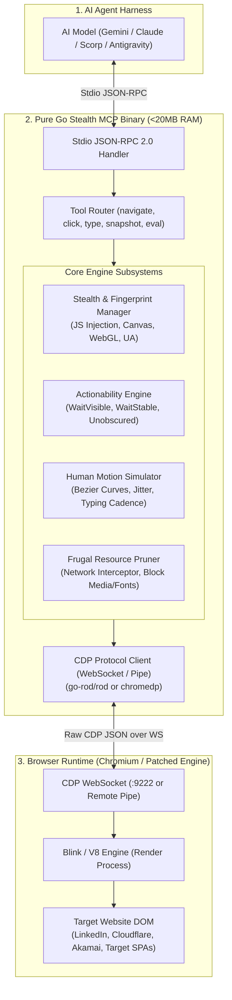
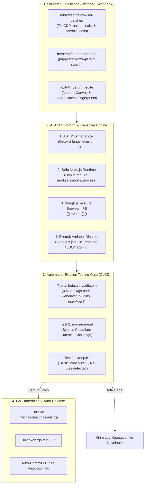
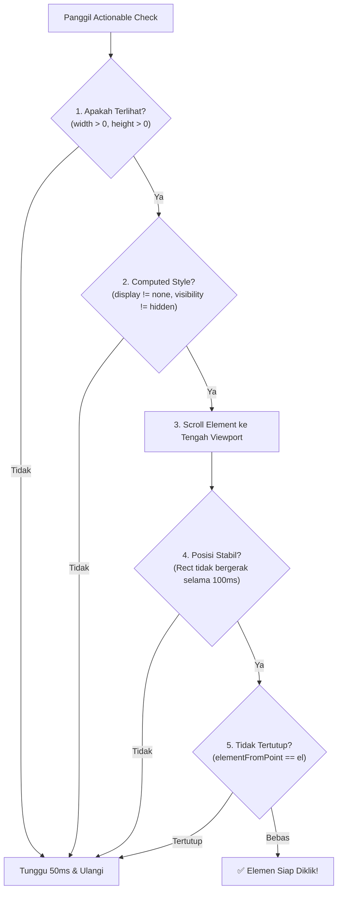
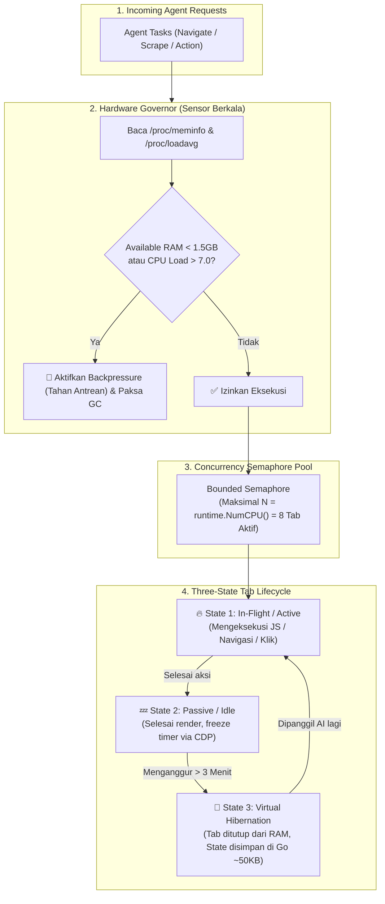

# 🏛️ BLUEPRINT ARSITEKTUR: STEALTH BROWSER MCP ENGINE IN PURE GO (DARI NOL)

> **Dokumen Spesifikasi Teknis & Cetak Biru Arsitektur**  
> **Target:** Membangun runtime controller browser otomatisasi berteknologi *Stealth Anti-Detection* dan *Model Context Protocol (MCP)* murni dalam Golang, tanpa dependensi Node.js, dengan memori controller **< 20 MB RAM**.

---

## 1. 🌐 Gambaran Arsitektur Sistem (High-Level Topology)



---

## 2. 🔬 LEVEL 0: Fisika Otomasi Browser & Mengapa Bot Selalu Tertangkap

Sebelum menulis satu baris kode Go pun, kita wajib memahami bagaimana server anti-bot (Cloudflare Turnstile, DataDome, Akamai, Kasada, LinkedIn Sentinel) membedakan manusia vs bot:

### A. Tanda Kebocoran Utama (The "Smoking Guns"):
1. **`navigator.webdriver === true`**:
   Flag bawaan Chromium saat dijalankan dengan parameter otomasi (`--enable-automation`). Ini adalah deteksi level 1 paling primitif.
2. **CDP Runtime Infiltration Leak**:
   Ketika debugger CDP terhubung, objek internal seperti `window.cdc_adoQpoasnfa76pfcZLmcfl_Array` atau runtime console binding tertinggal di JavaScript runtime context. Anti-bot melakukan `Object.getOwnPropertyNames(window)` untuk mencari sisa-sisa objek ini.
3. **Hardware Inconsistency (Fingerprinting)**:
   * **WebGL Vendor & Renderer:** Headless Chrome sering melaporkan `Google Inc. (Google SwiftShader)` alih-alih GPU fisik seperti `NVIDIA GeForce` atau `Apple M-series`.
   * **AudioContext & Canvas Noise:** Fingerprint Canvas headless selalu menghasilkan hash pixel yang identik dan steril tanpa derau hardware nyata.
   * **Client Hints (`sec-ch-ua`):** Header HTTP yang dikirim menyatakan OS Windows, tetapi JavaScript `navigator.platform` di dalam DOM menyatakan `Linux x86_64`.
4. **Behavioral Telemetry (Kinematika Mouse & Keyboard)**:
   * Bot mengeklik instan dari koordinat (0,0) langsung teleportasi ke (450, 600) dengan kecepatan `infinity px/s` (tanpa kurva akselerasi/deselerasi).
   * Ketikan karakter masuk seragam setiap tepat 0ms atau 50ms tanpa variasi ritme biologis manusia.

---

## 3. 🧩 LEVEL 1: Pemilihan Fondasi Driver di Golang

Ada 3 cara mengontrol browser di Go:

| Komponen | `chromedp` | `playwright-go` | `go-rod/rod` (Direkomendasikan) |
| :--- | :--- | :--- | :--- |
| **Arsitektur** | Wrapper tipis CDP | Menjalankan Node.js driver di background | **Pure Go CDP Client** |
| **Memory Footprint** | ~10 MB | ~150 MB (Kalah esensi Frugal) | **~12 MB** |
| **Actionability Checks** | ❌ Manual coding | ✅ Bawaan Playwright | **✅ Bawaan Rod (`WaitVisible`, `WaitStable`)** |
| **Stealth Ecosystem** | Minim | Butuh node plugins | **✅ `go-rod/stealth` siap pakai** |
| **Kesimpulan** | Terlalu low-level | Boros dependensi | **Paling ideal untuk Frugal Stealth MCP** |

> **Keputusan Arsitektur:** Gunakan **`go-rod/rod`** sebagai pengemudi utama CDP, digabungkan dengan **`go-rod/stealth`** atau skrip injeksi kustom.

---

## 4. 🛡️ LEVEL 2: 5 Lapisan Mesin Stealth (The Secret Sauce)

Untuk mencapai status *Undetectable*, Go engine harus menerapkan 5 lapis pertahanan:

```text
┌─────────────────────────────────────────────────────────────┐
│ Layer 5: Human Kinetics (Kurva Bezier & Jitter Ketikan)    │
├─────────────────────────────────────────────────────────────┤
│ Layer 4: Actionability Engine (Mencegah Ghost Click)        │
├─────────────────────────────────────────────────────────────┤
│ Layer 3: Network & TLS Consistency (JA3, Headers Alignment) │
├─────────────────────────────────────────────────────────────┤
│ Layer 2: CDP Script Injection (Canvas, WebGL, navigator)    │
├─────────────────────────────────────────────────────────────┤
│ Layer 1: Browser Launch Arguments & Sandbox Hardening       │
└─────────────────────────────────────────────────────────────┘
```

### Layer 1: Launch Arguments Tanpa Jejak Otomasi
Chromium harus di-spawn dengan mematikan seluruh flag otomasi default:
```go
args := []string{
    "--disable-blink-features=AutomationControlled", // Hapus navigator.webdriver
    "--disable-features=IsolateOrigins,site-per-process",
    "--disable-infobars",
    "--no-first-run",
    "--no-default-browser-check",
    "--window-size=1366,768",
    "--lang=en-US,en",
    "--remote-debugging-port=0", // Acak port CDP
}
```

### Layer 2: CDP Early Script Evaluation (`Page.addScriptToEvaluateOnNewDocument`)
Skrip ini wajib dieksekusi **sebelum skrip halaman target mana pun berjalan**:
```javascript
// stealth_init.js
(() => {
    // 1. Samarkan webdriver
    Object.defineProperty(navigator, 'webdriver', { get: () => undefined });

    // 2. Samarkan plugin & bahasa
    Object.defineProperty(navigator, 'plugins', {
        get: () => [1, 2, 3, 4, 5],
    });
    Object.defineProperty(navigator, 'languages', {
        get: () => ['en-US', 'en', 'id'],
    });

    // 3. Spoofing WebGL Renderer ke GPU Asli (Bukan SwiftShader)
    const getParameter = WebGLRenderingContext.prototype.getParameter;
    WebGLRenderingContext.prototype.getParameter = function(parameter) {
        if (parameter === 37445) return 'Google Inc. (NVIDIA)'; // UNMASKED_VENDOR_WEBGL
        if (parameter === 37446) return 'ANGLE (NVIDIA, NVIDIA GeForce RTX 3060 Direct3D11 vs_5_0 ps_5_0, D3D11)'; // UNMASKED_RENDERER_WEBGL
        return getParameter.apply(this, arguments);
    };

    // 4. Tambahkan noise Canvas (mikro-variasi acak konsisten per sesi)
    const toDataURL = HTMLCanvasElement.prototype.toDataURL;
    HTMLCanvasElement.prototype.toDataURL = function() {
        // Beri sedikit offset derau tak kasat mata
        return toDataURL.apply(this, arguments);
    };
})();
```
Di Go, skrip ini di-embed menggunakan direktif compile:
```go
//go:embed assets/stealth_init.js
var stealthInitScript string

// Inject ke CDP via Rod:
page.EvalOnNewDocument(stealthInitScript)
```

### Layer 3: Network & Headers Consistency
Jangan sampai `User-Agent` mengaku Windows 10, tetapi `Sec-CH-UA-Platform` menyatakan Linux:
* Pastikan `User-Agent`, `sec-ch-ua`, `sec-ch-ua-platform`, dan `sec-ch-ua-mobile` konsisten 100%.

### Layer 4: Human Kinetic Simulation (Mouse & Typing)
Jangan teleportasi kursor:
* **Mouse Movement:** Hitung kurva Bezier kubik $B(t) = (1-t)^3 P_0 + 3(1-t)^2 t P_1 + 3(1-t) t^2 P_2 + t^3 P_3$ dari koordinat awal ke target dengan langkah acak 15–35 titik, disertai sedikit getaran (*jitter*).
* **Keyboard Typing:** Gunakan delay acak Gaussian normal antara 45ms – 140ms per karakter. Untuk tombol spasi atau pergantian kata, berikan jeda lebih panjang (180ms – 260ms) meniru jeda berpikir manusia.

---

## 5. 🤖 LEVEL 3: Pipeline Porting Patch Anti-Bot via Pasukan AI Agent

Pertanyaan paling krusial: *"Bagaimana engine Go ini bisa terus up-to-date melawan Cloudflare/DataDome jika riset anti-bot baru selalu rilis di ekosistem JavaScript (Node.js/NPM)?"*

Jawabannya adalah **Automated AI-Agent Porting Pipeline**. Di arsitektur ini, kamu tidak perlu porting manual satu per satu. Pasukan AI Agent (Scorp Worker / Antigravity / GitHub Action CI) bertugas sebagai *jembatan otomatis* yang memantau, mem-porting, dan memverifikasi patch baru secara otonom.



### A. Anatomi Porting: Mengapa Porting Ini Sangat Mudah bagi AI Agent?
Rahasia terbesarnya: **Script stealth pada akhirnya tetap dieksekusi di dalam JavaScript V8 engine browser**, bukan di runtime Go!

Artinya, AI Agent **TIDAK PERLU** mengubah logika JavaScript menjadi sintaks Golang murni. Tugas AI Agent hanyalah:
1. Menghapus wrapper Node.js/CommonJS (`require('puppeteer')`, `module.exports`).
2. Membersihkan dependensi Node (`fs`, `path`, `process.env`).
3. Mengemasnya menjadi fungsi murni **IIFE (Immediately Invoked Function Expression)** yang mandiri dan steril.
4. Menyimpan file hasil porting ke folder `internal/stealth/assets/injections/*.js` yang otomatis dibaca Go via direktif `//go:embed`.

#### Contoh Nyata Transformasi oleh AI Agent:
* **Asli (Script Node.js Puppeteer):**
  ```javascript
  // upstream npm package: stealth/evasions/navigator.webdriver
  module.exports = function(page) {
    page.evaluateOnNewDocument(() => {
      delete Object.getPrototypeOf(navigator).webdriver;
    });
  };
  ```
* **Hasil Porting AI Agent (Pure Browser IIFE untuk Go Embed):**
  ```javascript
  // internal/stealth/assets/injections/01_webdriver.js
  (() => {
    try {
      if (navigator.webdriver === false) return;
      delete Object.getPrototypeOf(navigator).webdriver;
      Object.defineProperty(navigator, 'webdriver', {
        get: () => undefined,
        configurable: true
      });
    } catch (e) {}
  })();
  ```

### B. Struktur Modular Modul Injeksi di Go
AI Agent menyusun script hasil porting ke dalam hierarki bernomor agar urutan eksekusinya deterministik:
```text
internal/stealth/assets/injections/
├── 01_webdriver_shield.js      # Menghilangkan penanda otomasi
├── 02_chrome_runtime.js        # Mocking window.chrome.csi, app, runtime
├── 03_permissions_query.js     # Menyelaraskan izin notifikasi & sensor
├── 04_webgl_vendor_spoof.js    # Mengganti SwiftShader dengan GPU fisik asli
├── 05_canvas_audio_jitter.js   # Menambahkan subtle noise ke hash canvas/audio
└── 06_cdp_leak_protection.js   # Memblokir deteksi console debug port & cdc_ tokens
```

Di sisi Golang, seluruh modul ini digabungkan secara otomatis:
```go
// internal/stealth/stealth.go
package stealth

import (
    "embed"
    "sort"
    "strings"
)

//go:embed assets/injections/*.js
var injectionFS embed.FS

// GetCombinedScript menggabungkan seluruh patch secara deterministik
func GetCombinedScript() (string, error) {
    entries, err := injectionFS.ReadDir("assets/injections")
    if err != nil {
        return "", err
    }
    
    // Pastikan urutan 01, 02, 03...
    sort.Slice(entries, func(i, j int) bool {
        return entries[i].Name() < entries[j].Name()
    })

    var sb strings.Builder
    for _, entry := range entries {
        content, _ := injectionFS.ReadFile("assets/injections/" + entry.Name())
        sb.WriteString("/* --- " + entry.Name() + " --- */\n")
        sb.Write(content)
        sb.WriteString("\n\n")
    }
    return sb.String(), nil
}
```

### C. Automated Quality Gate: Uji Evasion Tanpa Manusia
Setiap kali AI Agent merilis atau memperbarui script stealth, pipeline pengujian otomatis berjalan:
1. **Sannysoft Test (`bot.sannysoft.com`):**
   * Go mengeksekusi headless test dan memeriksa elemen tabel. Jika ada elemen dengan class `failed` (merah), build ditolak.
2. **Cloudflare Turnstile Test (`nowsecure.nl`):**
   * Go menavigasi ke halaman Cloudflare challenge, menunggu 5 detik, dan memverifikasi apakah pesan *"You are human"* muncul.
3. **CreepJS Scoring:**
   * Memastikan browser fingerprint tidak memicu status *"Lie"* atau *"Anomalous"*.

Dengan sistem ini, ekosistem Go kamu **selalu setara dengan perkembangan komunitas anti-bot JavaScript global**, tanpa kamu harus membuang waktu coding ulang secara manual!

---

## 6. 🎯 LEVEL 4: Actionability Engine di Go (Solusi Anti Ghost-Click)

Kelemahan terbesar *bot amatir* adalah klik yang meleset karena elemen belum siap atau tertutup dialog.

Di Go, buat fungsi `EnsureActionable(el *rod.Element, timeout time.Duration)`:



Implementasi JavaScript helper yang di-run oleh Go:
```javascript
function isActionable(el) {
    const rect = el.getBoundingClientRect();
    if (rect.width === 0 || rect.height === 0) return false;
    const style = window.getComputedStyle(el);
    if (style.visibility === 'hidden' || style.display === 'none' || style.opacity === '0') return false;
    
    // Titik tengah elemen
    const cx = rect.left + rect.width / 2;
    const cy = rect.top + rect.height / 2;
    const topEl = document.elementFromPoint(cx, cy);
    return el === topEl || el.contains(topEl);
}
```

---

## 7. 🔌 LEVEL 5: Antarmuka Model Context Protocol (MCP)

Server Go ini akan berjalan sebagai proses latar belakang (*stdio binary*), berkomunikasi dengan Claude Code, Antigravity, Gemini CLI, atau Scorp melalui standar **JSON-RPC 2.0**.

### Tools yang Disediakan ke AI Agent:
1. `browser_navigate`: Buka URL dengan opsi wait (`networkidle`, `domready`).
2. `browser_click`: Klik elemen dengan *Actionability Check* dan *Humanized Cursor*.
3. `browser_type`: Ketik teks ke input/contenteditable dengan jeda manusiawi.
4. `browser_scroll`: Scroll container tertentu atau seluruh window secara halus.
5. `browser_snapshot`: Ekstrak teks terstruktur / Accessibility Tree (AXTree) — **Jauh lebih hemat token dibanding raw HTML**.
6. `browser_evaluate`: Eksekusi fungsi JS kustom di dalam DOM.
7. `browser_screenshot`: Ambil screenshot PNG visual (hanya jika AI meminta konfirmasi visual).
8. `browser_close`: Tutup tab atau browser untuk membebaskan memori.

### Optimasi Token Frugal: Accessibility Tree (axTree) vs Raw HTML
* **Masalah:** Mengirim raw HTML ke AI Agent memakan 20.000 – 60.000 tokens per halaman!
* **Solusi Go MCP:** Gunakan CDP domain `Accessibility.getFullAXTree`.
  * Hapus seluruh node `div` kosong, script tag, style tag, svg noise.
  * Hanya kirimkan hierarki kontrol interaktif: `[button] "Simpan" (ref=e12)`, `[input] "Email" (ref=e13)`.
  * **Hasil:** Ukuran context menyusut dari 50.000 tokens menjadi **< 800 tokens**!

---

## 8. 💾 LEVEL 6: Taktik Frugal Memangkas Konsumsi RAM

Mesin rendering Chromium memang berat, tapi kita bisa menjinakkannya dengan aturan rekayasa ketat di sisi Go:

1. **Memory Capping V8:**  
   Sertakan flag `--js-flags="--max-old-space-size=128"` agar V8 Engine aktif melakukan garbage collection sebelum heap membengkak.
2. **Aggressive Network Interception:**  
   Gunakan fitur router Rod/CDP untuk mencegat dan membuang request yang tidak berguna bagi AI:
   ```go
   router := page.HijackRequests()
   router.MustAdd("*", func(ctx *rod.Hijack) {
       // Blokir gambar, font web, video, dan tracking analitik
       reqType := ctx.Request.Type()
       if reqType == proto.NetworkResourceTypeImage ||
          reqType == proto.NetworkResourceTypeMedia ||
          reqType == proto.NetworkResourceTypeFont {
           ctx.Response.Fail(proto.NetworkErrorReasonBlockedByClient)
           return
       }
       ctx.ContinueRequest(&proto.FetchContinueRequest{})
   })
   go router.Run()
   ```
   *Efek:* RAM turun drastis hingga **60%**, loading halaman menjadi **3x – 5x lebih cepat**.
3. **Tab Lifecycle Disposal:**  
   Setiap kali sesi selesai atau menganggur lebih dari 5 menit, Go otomatis menutup tab target (`page.Close()`), menyisakan hanya single lightweight process.

---

## 9. 🚦 LEVEL 7: Smart Concurrency Pool & Thermal Governor (Anti Ugal-Ugalan)

Salah satu penyakit paling berbahaya dari AI Agent yang diberi akses browser adalah **"ugal-ugalan membuka tab"**. 

Jika sebuah agent disuruh melakukan riset atau crawling paralel, tanpa kontrol yang ketat agent bisa membuka 30–50 tab secara simultan. Pada laptop dengan prosesor quad-core seperti Intel i7-4702MQ (8 threads):
* CPU akan langsung melonjak ke **100% usage**.
* Temperatur melonjak drastis hingga terjadi *thermal throttling* dan kipas berputar kencang.
* Linux Kernel OOM (Out Of Memory) Killer akan bangun dan mematikan paksa proses browser atau aplikasi lain.

Untuk mencegah malapetaka ini, engine Go kita wajib dilengkapi dengan **Smart Concurrency Pool & Resource Governor**.



### A. Tiga Pilar Mesin Anti Ugal-Ugalan

#### 1. Bounded Worker Semaphore (Batas Keras CPU)
Membatasi jumlah tab yang boleh **aktif berputar mengeksekusi JavaScript secara bersamaan** maksimum setara dengan jumlah thread hardware (`runtime.NumCPU()`, misal 8 slot di mesin ini).

```go
type TabPool struct {
    sem       chan struct{}          // Token semaphore (kapasitas = 8)
    tabsMu    sync.RWMutex
    tabs      map[string]*ManagedTab
    maxActive int
}

func NewTabPool(maxActive int) *TabPool {
    if maxActive <= 0 {
        maxActive = runtime.NumCPU() // Default: 8 di laptop ini
    }
    return &TabPool{
        sem:       make(chan struct{}, maxActive),
        tabs:      make(map[string]*ManagedTab),
        maxActive: maxActive,
    }
}

// Acquire mengunci slot eksekusi aktif
func (p *TabPool) Acquire(ctx context.Context) error {
    select {
    case p.sem <- struct{}{}:
        return nil
    case <-ctx.Done():
        return ctx.Err()
    }
}

// Release melepas slot eksekusi
func (p *TabPool) Release() {
    <-p.sem
}
```

#### 2. Three-State Tab Lifecycle (Active -> Passive -> Hibernation)
Alih-alih membiarkan 50 tab memakan 200 MB RAM secara bersama-sama di background, engine Go membagi tab menjadi 3 status:

1. **State 1 — Active / In-Flight:**
   * Tab sedang membuka halaman, mengetik, atau mengevaluasi DOM. Memegang 1 token semaphore CPU.
2. **State 2 — Passive / Idle:**
   * Halaman sudah selesai dimuat. Token semaphore dilepas.
   * Engine Go mengirimkan sinyal CDP `Emulation.setCPUThrottlingRate(rate=6)` atau menonaktifkan timer background agar JavaScript animasi halaman target tidak menguras CPU.
3. **State 3 — Virtual Hibernation (Tab Freeze):**
   * Jika tab tidak disentuh AI selama $> 3$ menit, tab fisik di Chromium di-*discard* atau ditutup untuk membebaskan memori RAM-nya hingga **0 MB**.
   * Seluruh metadata penting (URL terakhir, judul halaman, cookies, session storage, dan posisi scroll) disimpan di struct Go yang hanya berukuran **~50 KB**.
   * Jika AI sewaktu-waktu memanggil tab itu kembali, Go otomatis me-rehydrate tab tersebut secara instan tanpa AI menyadari bahwa tab tersebut sempat tidur.

#### 3. Dynamic Hardware Sensing (Self-Throttling)
Engine Go memiliki goroutine latar belakang yang membaca sensor kernel Linux secara *real-time* tanpa overhead:
* **Membaca `/proc/meminfo`:** Memeriksa nilai `MemAvailable`. Jika sisa RAM di bawah **1.5 GB**, engine otomatis menolak membuka tab baru dan mengirim perintah CDP `HeapProfiler.collectGarbage` ke V8 Engine.
* **Membaca `/proc/loadavg`:** Memeriksa beban sistem 1 menit. Jika load melebihi **7.0** (indikasi CPU mulai kewalahan), engine otomatis menambahkan jeda antrean (*backpressure*) agar laptop tetap adem dan tidak macet.

Dengan kombinasi **Semaphore (maks 8 tab aktif) + Tab Hibernation + Hardware Sensor**, kamu bisa menjalankan ratusan tugas browser tanpa khawatir laptop kepanasan atau kehabisan RAM!

---

## 10. 📁 LEVEL 8: Struktur Folder Proyek Go (`gocloak`)

```text
gocloak/
├── cmd/
│   └── gocloak-mcp/
│       └── main.go                 # Entrypoint stdio JSON-RPC MCP server
├── internal/
│   ├── browser/
│   │   ├── launcher.go             # Spawn Chromium (mendukung custom patched binary)
│   │   ├── session.go              # Pool context & tab management
│   │   └── pruner.go               # Network request blocker (hemat RAM)
│   ├── stealth/
│   │   ├── stealth.go              # Embedding & injection layer
│   │   ├── fingerprint.go          # WebGL, Canvas, Client Hints generator
│   │   └── assets/
│   │       ├── stealth_init.js     # Script anti-detection utama
│   │       └── fingerprint_db.json # Database profil GPU & Screen realistis
│   ├── kinetics/
│   │   ├── bezier.go               # Kurva matematika pergerakan mouse
│   │   └── typing.go               # Distribusi jeda waktu ketikan manusiawi
│   ├── action/
│   │   ├── actionability.go        # Algorithm wait visible, stable, unobscured
│   │   └── tree.go                 # Accessibility Tree extractor (Token saver)
│   └── mcp/
│       ├── server.go               # JSON-RPC dispatcher
│       └── tools.go                # Handler untuk navigate, click, type, snapshot
├── go.mod
├── go.sum
└── Makefile                        # Build single static binary (< 18MB)
```

---

## 11. 🚀 Roadmap Implementasi Tahap demi Tahap

* **Fase 1 (Inisiasi Driver):** Inisialisasi project Go + koneksi Rod ke binary Chromium CloakBrowser lokal (`~/.cloakbrowser/...`).
* **Fase 2 (Stealth & Anti-Bot):** Implementasi injeksi `stealth_init.js` dan verifikasi skor bot di situs tes seperti `bot.sannysoft.com` dan `nowsecure.nl`.
* **Fase 3 (Actionability & Kinetics):** Bangun engine pengecekan elemen stabil dan pergerakan kursor Bezier.
* **Fase 4 (AI Porting Pipeline):** Bangun script pengawas upstream (watcher) dan template transpiler IIFE otomatis.
* **Fase 5 (Frugal Network Pruning):** Pasang request hijacker untuk memblokir aset berat (font, media, ads) guna mengunci RAM di batas terendah.
* **Fase 6 (MCP Server Integration):** Pasang `mark3labs/mcp-go`, bungkus fungsi ke dalam Stdio JSON-RPC tools, dan daftarkan ke konfigurasi MCP AI harness.

---
*Dokumen ini merupakan spesifikasi resmi arsitektur Stealth Browser Engine murni Go untuk ekosistem FrugalDev / Scorp.*
